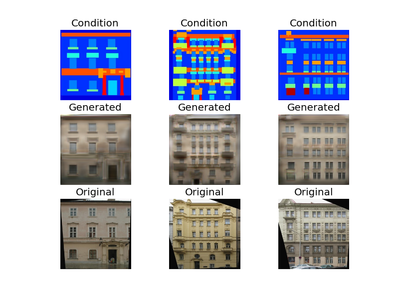
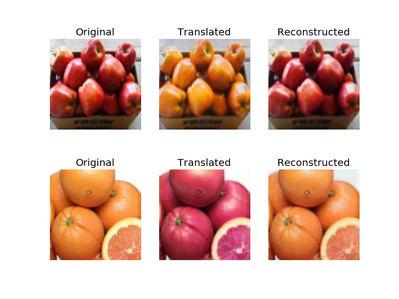

# Generative_adversarial_networks
Implementation of few of the GAN architectures 

# Table of content
- [Deep convolutional GAN](dcgan)

- [Conditional GAN](cgan)

- [Info GAN](infogan)
- [Wasserstein GAN](wgan)

- [Pix2Pix](pix2pix)

- [Cycle GAN](cycle_gan)

